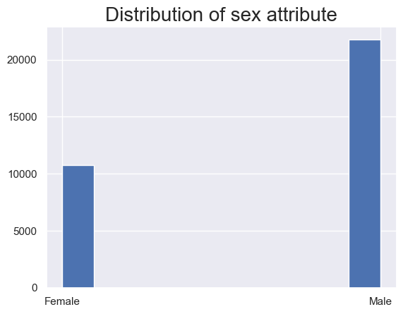
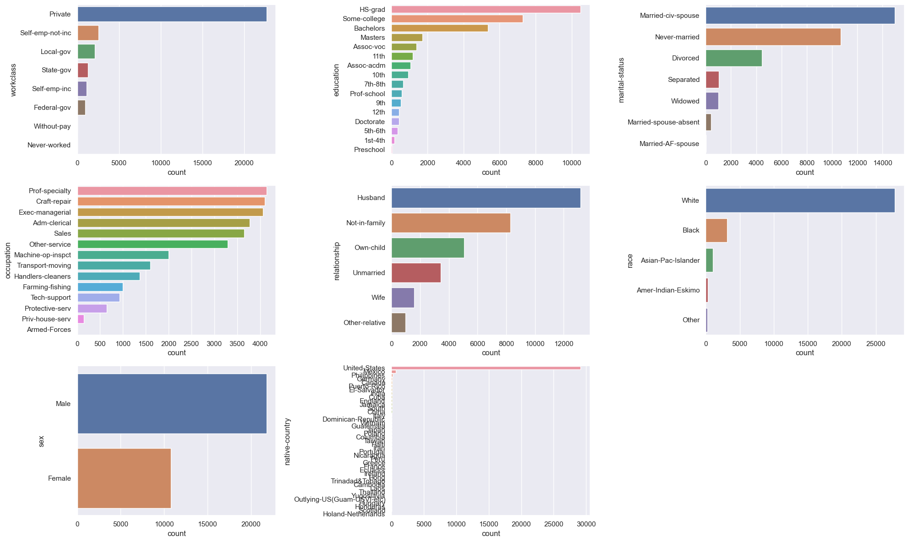
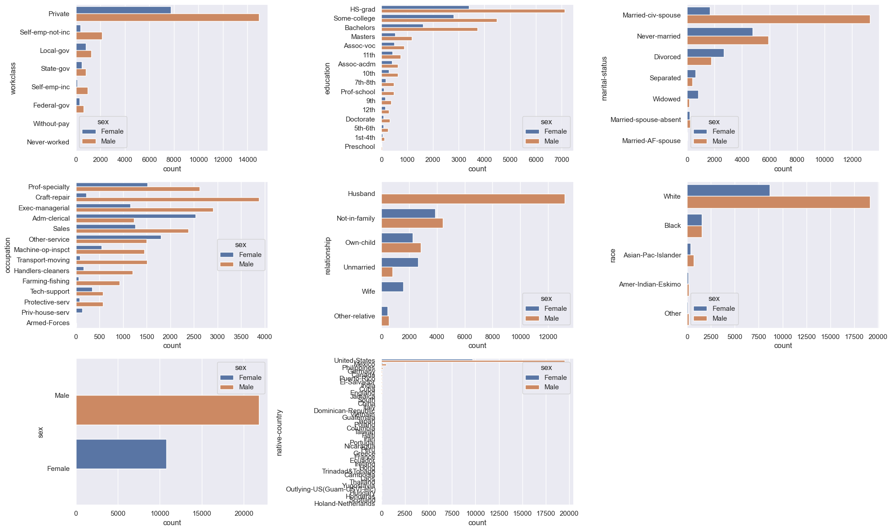
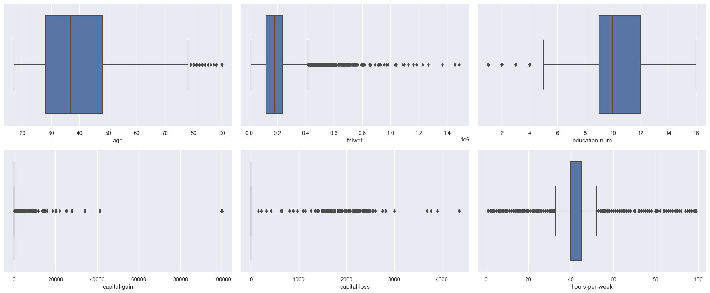
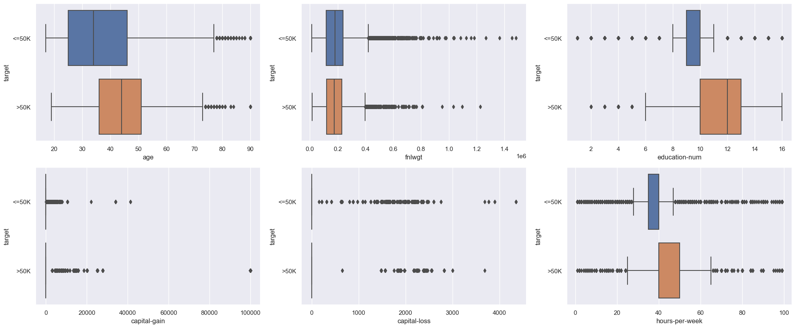
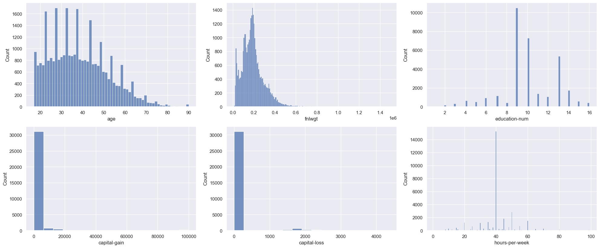
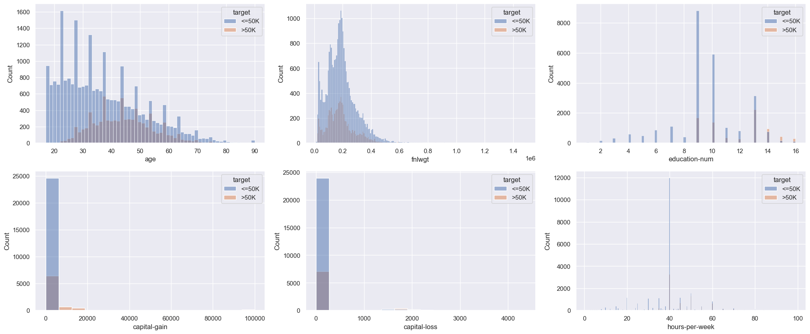

```python
import pandas as pd # For loading the data and processing it
import numpy as np
import seaborn as sns           # data visualization
import matplotlib.pyplot as plt # for data visualization

 
# Generate the charts just below the plot commands
%matplotlib inline


## import libraries for evaluating the templates
from sklearn.model_selection import train_test_split, cross_validate, cross_val_score
from sklearn.model_selection import RepeatedKFold, GridSearchCV
from sklearn import metrics
from sklearn.neighbors import KNeighborsClassifier
from sklearn.tree import DecisionTreeClassifier
sns.set()


# define specific data types for each attribute
data_types =   {'hours.per.week'            : 'uint8',   
                'occupation'      : 'category',
                'fnlwgt'         : 'int32',   
                'sex'            : 'category',
                'education.num'  : 'uint8',   
                'relationship'   : 'category',
                'workclass'      : 'category',
                'marital.status'   : 'category',  
                'race'           : 'category',
                'education'      : 'category',
                'capital.loss'   : 'int32',   
                'capital.gain'   : 'int32',  
                'age'            : 'uint8',   
                'native.country' : 'category',
                'income'         : 'category'}

#load the data

df = pd.read_csv("file:///C:/Users/User/Desktop/adult.csv",
                 sep=',', na_values='?', dtype = data_types)
df.head()
```


<div>
<style scoped>
    .dataframe tbody tr th:only-of-type {
        vertical-align: middle;
    }

    .dataframe tbody tr th {
        vertical-align: top;
    }

    .dataframe thead th {
        text-align: right;
    }
</style>
<table border="1" class="dataframe">
  <thead>
    <tr style="text-align: right;">
      <th></th>
      <th>age</th>
      <th>workclass</th>
      <th>fnlwgt</th>
      <th>education</th>
      <th>education.num</th>
      <th>marital.status</th>
      <th>occupation</th>
      <th>relationship</th>
      <th>race</th>
      <th>sex</th>
      <th>capital.gain</th>
      <th>capital.loss</th>
      <th>hours.per.week</th>
      <th>native.country</th>
      <th>income</th>
    </tr>
  </thead>
  <tbody>
    <tr>
      <th>0</th>
      <td>90</td>
      <td>NaN</td>
      <td>77053</td>
      <td>HS-grad</td>
      <td>9</td>
      <td>Widowed</td>
      <td>NaN</td>
      <td>Not-in-family</td>
      <td>White</td>
      <td>Female</td>
      <td>0</td>
      <td>4356</td>
      <td>40</td>
      <td>United-States</td>
      <td>&lt;=50K</td>
    </tr>
    <tr>
      <th>1</th>
      <td>82</td>
      <td>Private</td>
      <td>132870</td>
      <td>HS-grad</td>
      <td>9</td>
      <td>Widowed</td>
      <td>Exec-managerial</td>
      <td>Not-in-family</td>
      <td>White</td>
      <td>Female</td>
      <td>0</td>
      <td>4356</td>
      <td>18</td>
      <td>United-States</td>
      <td>&lt;=50K</td>
    </tr>
    <tr>
      <th>2</th>
      <td>66</td>
      <td>NaN</td>
      <td>186061</td>
      <td>Some-college</td>
      <td>10</td>
      <td>Widowed</td>
      <td>NaN</td>
      <td>Unmarried</td>
      <td>Black</td>
      <td>Female</td>
      <td>0</td>
      <td>4356</td>
      <td>40</td>
      <td>United-States</td>
      <td>&lt;=50K</td>
    </tr>
    <tr>
      <th>3</th>
      <td>54</td>
      <td>Private</td>
      <td>140359</td>
      <td>7th-8th</td>
      <td>4</td>
      <td>Divorced</td>
      <td>Machine-op-inspct</td>
      <td>Unmarried</td>
      <td>White</td>
      <td>Female</td>
      <td>0</td>
      <td>3900</td>
      <td>40</td>
      <td>United-States</td>
      <td>&lt;=50K</td>
    </tr>
    <tr>
      <th>4</th>
      <td>41</td>
      <td>Private</td>
      <td>264663</td>
      <td>Some-college</td>
      <td>10</td>
      <td>Separated</td>
      <td>Prof-specialty</td>
      <td>Own-child</td>
      <td>White</td>
      <td>Female</td>
      <td>0</td>
      <td>3900</td>
      <td>40</td>
      <td>United-States</td>
      <td>&lt;=50K</td>
    </tr>
  </tbody>
</table>
</div>


```python


#display additional information about the dataset
df.info()


```

    <class 'pandas.core.frame.DataFrame'>
    RangeIndex: 32561 entries, 0 to 32560
    Data columns (total 15 columns):
     #   Column          Non-Null Count  Dtype   
    ---  ------          --------------  -----   
     0   age             32561 non-null  uint8   
     1   workclass       30725 non-null  category
     2   fnlwgt          32561 non-null  int32   
     3   education       32561 non-null  category
     4   education.num   32561 non-null  uint8   
     5   marital.status  32561 non-null  category
     6   occupation      30718 non-null  category
     7   relationship    32561 non-null  category
     8   race            32561 non-null  category
     9   sex             32561 non-null  category
     10  capital.gain    32561 non-null  int32   
     11  capital.loss    32561 non-null  int32   
     12  hours.per.week  32561 non-null  uint8   
     13  native.country  31978 non-null  category
     14  income          32561 non-null  category
    dtypes: category(9), int32(3), uint8(3)
    memory usage: 767.1 KB
    


```python


df.rename({'income': 'target', 'education.num': 'education-num',
           'marital.status': 'marital-status', 'capital.gain': 'capital-gain',
           'capital.loss': 'capital-loss', 'hours.per.week': 'hours-per-week',
           'native.country': 'native-country'}, axis=1, inplace=True)
df.columns


```


    Index(['age', 'workclass', 'fnlwgt', 'education', 'education-num',
           'marital-status', 'occupation', 'relationship', 'race', 'sex',
           'capital-gain', 'capital-loss', 'hours-per-week', 'native-country',
           'target'],
          dtype='object')


```python


# Display summary for categorical attributes
df.describe(include='category')


```


<div>
<style scoped>
    .dataframe tbody tr th:only-of-type {
        vertical-align: middle;
    }

    .dataframe tbody tr th {
        vertical-align: top;
    }

    .dataframe thead th {
        text-align: right;
    }
</style>
<table border="1" class="dataframe">
  <thead>
    <tr style="text-align: right;">
      <th></th>
      <th>workclass</th>
      <th>education</th>
      <th>marital-status</th>
      <th>occupation</th>
      <th>relationship</th>
      <th>race</th>
      <th>sex</th>
      <th>native-country</th>
      <th>target</th>
    </tr>
  </thead>
  <tbody>
    <tr>
      <th>count</th>
      <td>30725</td>
      <td>32561</td>
      <td>32561</td>
      <td>30718</td>
      <td>32561</td>
      <td>32561</td>
      <td>32561</td>
      <td>31978</td>
      <td>32561</td>
    </tr>
    <tr>
      <th>unique</th>
      <td>8</td>
      <td>16</td>
      <td>7</td>
      <td>14</td>
      <td>6</td>
      <td>5</td>
      <td>2</td>
      <td>41</td>
      <td>2</td>
    </tr>
    <tr>
      <th>top</th>
      <td>Private</td>
      <td>HS-grad</td>
      <td>Married-civ-spouse</td>
      <td>Prof-specialty</td>
      <td>Husband</td>
      <td>White</td>
      <td>Male</td>
      <td>United-States</td>
      <td>&lt;=50K</td>
    </tr>
    <tr>
      <th>freq</th>
      <td>22696</td>
      <td>10501</td>
      <td>14976</td>
      <td>4140</td>
      <td>13193</td>
      <td>27816</td>
      <td>21790</td>
      <td>29170</td>
      <td>24720</td>
    </tr>
  </tbody>
</table>
</div>


```python


df.dtypes


```


    age                  uint8
    workclass         category
    fnlwgt               int32
    education         category
    education.num        uint8
    marital.status    category
    occupation        category
    relationship      category
    race              category
    sex               category
    capital.gain         int32
    capital.loss         int32
    hours.per.week       uint8
    native.country    category
    income            category
    dtype: object


```python
# display distribution of target attribute
plt.hist(df['sex'])
plt.title("Distribution of sex attribute", fontsize=20)
plt.show()
```


    

    


```python
#inspect the education attribute
df[['education-num', 'education']].value_counts().\
  reset_index().sort_values(by='education-num') 
```


<div>
<style scoped>
    .dataframe tbody tr th:only-of-type {
        vertical-align: middle;
    }

    .dataframe tbody tr th {
        vertical-align: top;
    }

    .dataframe thead th {
        text-align: right;
    }
</style>
<table border="1" class="dataframe">
  <thead>
    <tr style="text-align: right;">
      <th></th>
      <th>education-num</th>
      <th>education</th>
      <th>0</th>
    </tr>
  </thead>
  <tbody>
    <tr>
      <th>15</th>
      <td>1</td>
      <td>Preschool</td>
      <td>51</td>
    </tr>
    <tr>
      <th>14</th>
      <td>2</td>
      <td>1st-4th</td>
      <td>168</td>
    </tr>
    <tr>
      <th>13</th>
      <td>3</td>
      <td>5th-6th</td>
      <td>333</td>
    </tr>
    <tr>
      <th>8</th>
      <td>4</td>
      <td>7th-8th</td>
      <td>646</td>
    </tr>
    <tr>
      <th>10</th>
      <td>5</td>
      <td>9th</td>
      <td>514</td>
    </tr>
    <tr>
      <th>7</th>
      <td>6</td>
      <td>10th</td>
      <td>933</td>
    </tr>
    <tr>
      <th>5</th>
      <td>7</td>
      <td>11th</td>
      <td>1175</td>
    </tr>
    <tr>
      <th>11</th>
      <td>8</td>
      <td>12th</td>
      <td>433</td>
    </tr>
    <tr>
      <th>0</th>
      <td>9</td>
      <td>HS-grad</td>
      <td>10501</td>
    </tr>
    <tr>
      <th>1</th>
      <td>10</td>
      <td>Some-college</td>
      <td>7291</td>
    </tr>
    <tr>
      <th>4</th>
      <td>11</td>
      <td>Assoc-voc</td>
      <td>1382</td>
    </tr>
    <tr>
      <th>6</th>
      <td>12</td>
      <td>Assoc-acdm</td>
      <td>1067</td>
    </tr>
    <tr>
      <th>2</th>
      <td>13</td>
      <td>Bachelors</td>
      <td>5355</td>
    </tr>
    <tr>
      <th>3</th>
      <td>14</td>
      <td>Masters</td>
      <td>1723</td>
    </tr>
    <tr>
      <th>9</th>
      <td>15</td>
      <td>Prof-school</td>
      <td>576</td>
    </tr>
    <tr>
      <th>12</th>
      <td>16</td>
      <td>Doctorate</td>
      <td>413</td>
    </tr>
  </tbody>
</table>
</div>


```python
# Separate attributes into vectors according to data type (categorical or numeric)
cat_columns = list(df.drop(['target'], axis=1).select_dtypes(include=["category"]).columns)
print("cat_columns:", cat_columns, "=>", len(cat_columns))

num_columns = list(df.select_dtypes(include=["uint8", "int32", "int64", "float64"]).columns)
print("num_columns:", num_columns, "=>", len(num_columns))
```

    cat_columns: ['workclass', 'education', 'marital-status', 'occupation', 'relationship', 'race', 'sex', 'native-country'] => 8
    num_columns: ['age', 'fnlwgt', 'education-num', 'capital-gain', 'capital-loss', 'hours-per-week'] => 6
    


```python
def count_plot(df, columns, label=None):
    plt.figure(figsize=(20, 12))
    for indx, var in enumerate(columns):
        plt.subplot(3, 3, indx + 1)
        if not label:
          g = sns.countplot(y=var, data=df,
                            order=df[var].value_counts().index)
        else:
          g = sns.countplot(y=var, data=df,
                            order=df[var].value_counts().index,
                            hue=label)
    plt.tight_layout()

def dist_plot(df, columns, type='boxplot', label=None):
    plt.figure(figsize=(20, 12))
    for indx, var in enumerate(columns):
        plt.subplot(3, 3, indx + 1)
        if (type=='boxplot'):
          if not label:
            g = sns.boxplot(x=var, data=df, showfliers=True)
          else:
            g = sns.boxplot(x=var, data=df, showfliers=True, y=label)
        elif (type=='histogram'):
          if not label:
            g = sns.histplot(x=var, data=df)
          else:
            g = sns.histplot(x=var, data=df, hue=label)
    plt.tight_layout()
```


```python


count_plot(df, cat_columns)


```


    

    


```python


# plot categorical columns (comparison based on sex)
count_plot(df, cat_columns, 'sex')


```


    

    


```python


dist_plot(df, num_columns)


```


    

    


```python
#plot numeric columns in a boxplot (comparison based on sex)
dist_plot(df, num_columns, label='target')
```


    

    


```python


# plot numeric columns(absolute quantities) in histograms
dist_plot(df, num_columns, type="histogram")


```


    

    


```python
dist_plot(df, num_columns, type="histogram", label='target')
```


    

    


```python


# analyse the general dataset
df.info()


```

    <class 'pandas.core.frame.DataFrame'>
    RangeIndex: 32561 entries, 0 to 32560
    Data columns (total 15 columns):
     #   Column          Non-Null Count  Dtype   
    ---  ------          --------------  -----   
     0   age             32561 non-null  uint8   
     1   workclass       30725 non-null  category
     2   fnlwgt          32561 non-null  int32   
     3   education       32561 non-null  category
     4   education-num   32561 non-null  uint8   
     5   marital-status  32561 non-null  category
     6   occupation      30718 non-null  category
     7   relationship    32561 non-null  category
     8   race            32561 non-null  category
     9   sex             32561 non-null  category
     10  capital-gain    32561 non-null  int32   
     11  capital-loss    32561 non-null  int32   
     12  hours-per-week  32561 non-null  uint8   
     13  native-country  31978 non-null  category
     14  target          32561 non-null  category
    dtypes: category(9), int32(3), uint8(3)
    memory usage: 767.2 KB
    


```python
# Display quantities of missing values in each attribute
total = len(df)
for col in df.columns:
  qtde = len(df[df[col].isna()])
  if (qtde > 0):
    print('%-14s => %6d nulls (%2.1f%%)' % (col, qtde, qtde / total * 100))
```

    workclass      =>   1836 nulls (5.6%)
    occupation     =>   1843 nulls (5.7%)
    native-country =>    583 nulls (1.8%)
    


```python
def analyze_outliers_iqr(X, features):

    indices = [x for x in X.index]
    qt_lines_total = len(indices)
    print('Number of lines:', qt_lines_total)
    
    print('Number of Attributes:', len(features))
    print('Attributes:', features)

    out_indexlist = []
    for col in features:
        Q1 = np.nanpercentile(X[col], 25.)
        Q2 = np.nanpercentile(X[col], 50.)
        Q3 = np.nanpercentile(X[col], 75.)
        
        cut_off = (Q3 - Q1) * 1.5
        upper, lower = Q3 + cut_off, Q1 - cut_off
        print('\nAttribute:', col)
        print('- Inferior limit: %.2f' % lower)
        print('- Median:         %.2f' % Q2)
        print('- Superior limit: %.2f' % upper)
                
        outliers_index = X[col][(X[col] < lower) | (X[col] > upper)].index.tolist()
        outliers = X[col][(X[col] < lower) | (X[col] > upper)].values
        qtd_outliers = len(outliers)
        print('- Number of outliers: %d (%.1f%%)' % \
              (qtd_outliers, qtd_outliers / qt_lines_total * 100))
        
        print('- Sample of outliers:', outliers[:50])
        
        out_indexlist.extend(outliers_index)
        
    out_indexlist = list(set(out_indexlist))
    out_indexlist.sort()
    qt_lines_outliers = len(out_indexlist)
    print('nNumber of lines with outliers: %d (%.1f%%)' % \
          (qt_lines_outliers, qt_lines_outliers / qt_lines_total * 100))
```


```python


# view report of outliers 
analyze_outliers_iqr(df, num_columns)


```

    Number of lines: 32561
    Number of Attributes: 6
    Attributes: ['age', 'fnlwgt', 'education-num', 'capital-gain', 'capital-loss', 'hours-per-week']
    
    Attribute: age
    - Inferior limit: -2.00
    - Median:         37.00
    - Superior limit: 78.00
    - Number of outliers: 143 (0.4%)
    - Sample of outliers: [90 82 83 81 90 80 81 90 79 90 83 79 79 80 90 90 90 90 79 90 81 90 81 79
     80 90 90 79 80 81 90 88 90 90 80 90 82 79 81 83 90 79 81 90 90 80 90 79
     84 80]
    
    Attribute: fnlwgt
    - Inferior limit: -61009.00
    - Median:         178356.00
    - Superior limit: 415887.00
    - Number of outliers: 992 (3.0%)
    - Sample of outliers: [422013 456062 427422 816750 454508 469705 445382 437727 511668 459189
     608184 531055 530099 467579 423605 494223 428350 469907 668319 540712
     460408 566537 435835 432555 651396 518030 428499 474136 442359 501172
     495061 462180 423222 478829 553405 673764 422149 431426 425161 424079
     506329 447066 588003 747719 543922 538443 452640 436861 493034 589809]
    
    Attribute: education-num
    - Inferior limit: 4.50
    - Median:         10.00
    - Superior limit: 16.50
    - Number of outliers: 1198 (3.7%)
    - Sample of outliers: [4 2 3 3 3 3 4 4 4 2 3 3 4 4 4 4 3 4 4 3 3 2 1 4 1 4 4 4 4 3 4 4 4 2 4 4 3
     4 4 4 1 4 2 4 4 3 3 4 3 3]
    
    Attribute: capital-gain
    - Inferior limit: 0.00
    - Median:         0.00
    - Superior limit: 0.00
    - Number of outliers: 2712 (8.3%)
    - Sample of outliers: [99999 99999 99999 99999 99999 99999 99999 99999 99999 99999 99999 99999
     99999 99999 99999 99999 99999 99999 99999 99999 99999 99999 99999 99999
     99999 99999 99999 99999 99999 99999 99999 99999 99999 99999 99999 99999
     99999 99999 99999 99999 99999 99999 99999 99999 99999 99999 99999 99999
     99999 99999]
    
    Attribute: capital-loss
    - Inferior limit: 0.00
    - Median:         0.00
    - Superior limit: 0.00
    - Number of outliers: 1519 (4.7%)
    - Sample of outliers: [4356 4356 4356 3900 3900 3770 3770 3683 3683 3004 3004 2824 2824 2824
     2824 2824 2824 2824 2824 2824 2824 2754 2754 2603 2603 2603 2603 2603
     2559 2559 2559 2559 2559 2559 2559 2559 2559 2559 2559 2559 2547 2547
     2547 2547 2489 2472 2467 2457 2457 2457]
    
    Attribute: hours-per-week
    - Inferior limit: 32.50
    - Median:         40.00
    - Superior limit: 52.50
    - Number of outliers: 9008 (27.7%)
    - Sample of outliers: [18 20 60 20 55 76 25 32 32 90 60 60 60 15 70 72 70  6 70 60 60 60 55 65
     60 12 65 55 80 70 55 55 67 99 60 80 99 60 55 30 55 90 20 60 75 25  6 60
     55 60]
    nNumber of lines with outliers: 13564 (41.7%)
    


```python
#data preprocessing

before = len(df)
print("before: ", before, "lines")

# remove duplicate lines
df.drop_duplicates(inplace=True)

after = len(df)
print("After:", after, "lines")

print("\nRemove %d duplicate lines" % (before - after))
```

    before:  32561 lines
    After: 32537 lines
    
    Remove 24 duplicate lines
    


```python
# analyze column distribution (top 10 most frequent)
df['native-country'].value_counts(normalize=True).head(10)
```


    United-States    0.912314
    Mexico           0.019997
    Philippines      0.006196
    Germany          0.004287
    Canada           0.003787
    Puerto-Rico      0.003568
    El-Salvador      0.003317
    India            0.003129
    Cuba             0.002973
    England          0.002816
    Name: native-country, dtype: float64


```python


#remove column: 'native-country'
df.drop('native-country', axis=1, inplace=True)
cat_columns.remove('native-country')


```


```python
#remove education
df.drop('education', axis=1, inplace=True)
cat_columns.remove('education')
```


```python
#remove fnlwgt
df.drop('fnlwgt', axis=1, inplace=True)
num_columns.remove('fnlwgt')
```


```python
# display contents of categorical columns
for col in cat_columns:
  print("\n%s:" % col, df[col].unique())
```

    
    workclass: [NaN, 'Private', 'State-gov', 'Federal-gov', 'Self-emp-not-inc', 'Self-emp-inc', 'Local-gov', 'Without-pay', 'Never-worked']
    Categories (8, object): ['Federal-gov', 'Local-gov', 'Never-worked', 'Private', 'Self-emp-inc', 'Self-emp-not-inc', 'State-gov', 'Without-pay']
    
    marital-status: ['Widowed', 'Divorced', 'Separated', 'Never-married', 'Married-civ-spouse', 'Married-spouse-absent', 'Married-AF-spouse']
    Categories (7, object): ['Divorced', 'Married-AF-spouse', 'Married-civ-spouse', 'Married-spouse-absent', 'Never-married', 'Separated', 'Widowed']
    
    occupation: [NaN, 'Exec-managerial', 'Machine-op-inspct', 'Prof-specialty', 'Other-service', ..., 'Farming-fishing', 'Tech-support', 'Protective-serv', 'Armed-Forces', 'Priv-house-serv']
    Length: 15
    Categories (14, object): ['Adm-clerical', 'Armed-Forces', 'Craft-repair', 'Exec-managerial', ..., 'Protective-serv', 'Sales', 'Tech-support', 'Transport-moving']
    
    relationship: ['Not-in-family', 'Unmarried', 'Own-child', 'Other-relative', 'Husband', 'Wife']
    Categories (6, object): ['Husband', 'Not-in-family', 'Other-relative', 'Own-child', 'Unmarried', 'Wife']
    
    race: ['White', 'Black', 'Asian-Pac-Islander', 'Other', 'Amer-Indian-Eskimo']
    Categories (5, object): ['Amer-Indian-Eskimo', 'Asian-Pac-Islander', 'Black', 'Other', 'White']
    
    sex: ['Female', 'Male']
    Categories (2, object): ['Female', 'Male']
    


```python
# grouping of the attribute "marital-status"
group_marital_status = {
  'Never-married': 'NotMarried',
  'Married-AF-spouse': 'Married',
  'Married-civ-spouse': 'Married',
  'Married-spouse-absent': 'NotMarried',
  'Separated': 'Separated',
  'Divorced': 'Separated',
  'Widowed': 'Widowed'
}
group_marital_status
```


    {'Never-married': 'NotMarried',
     'Married-AF-spouse': 'Married',
     'Married-civ-spouse': 'Married',
     'Married-spouse-absent': 'NotMarried',
     'Separated': 'Separated',
     'Divorced': 'Separated',
     'Widowed': 'Widowed'}


```python
df.columns
```


    Index(['age', 'workclass', 'education-num', 'marital-status', 'occupation',
           'relationship', 'race', 'sex', 'capital-gain', 'capital-loss',
           'hours-per-week', 'target'],
          dtype='object')


```python
# group values of the attribute "marital-status"
df['marital-status-group'] = df['marital-status'].\
  map(group_marital_status).astype('category')
df['marital-status-group']
```


    0           Widowed
    1           Widowed
    2           Widowed
    3         Separated
    4         Separated
                ...    
    32556    NotMarried
    32557       Married
    32558       Married
    32559       Widowed
    32560    NotMarried
    Name: marital-status-group, Length: 32537, dtype: category
    Categories (4, object): ['Married', 'NotMarried', 'Separated', 'Widowed']


```python
#remove original column
df.drop('marital-status', axis=1, inplace=True)
```


```python
#visualize resulting distribution
plt.figure(figsize=(12, 6))
sns.countplot(x='marital-status-group', data=df)
plt.show()


```


    

    


```python
# view general data frame
df.info()
```

    <class 'pandas.core.frame.DataFrame'>
    Int64Index: 32537 entries, 0 to 32560
    Data columns (total 12 columns):
     #   Column                Non-Null Count  Dtype   
    ---  ------                --------------  -----   
     0   age                   32537 non-null  uint8   
     1   workclass             30701 non-null  category
     2   education-num         32537 non-null  uint8   
     3   occupation            30694 non-null  category
     4   relationship          32537 non-null  category
     5   race                  32537 non-null  category
     6   sex                   32537 non-null  category
     7   capital-gain          32537 non-null  int32   
     8   capital-loss          32537 non-null  int32   
     9   hours-per-week        32537 non-null  uint8   
     10  target                32537 non-null  category
     11  marital-status-group  32537 non-null  category
    dtypes: category(7), int32(2), uint8(3)
    memory usage: 827.9 KB
    


```python
# update attribute vectors after dataset modifications
# separate attributes into vectors according to data type (categorical or numeric)
cat_columns = list(df.drop(['target'], axis=1).select_dtypes(include=["category"]).columns)
print("cat_columns:", cat_columns, "=>", len(cat_columns))

num_columns = list(df.select_dtypes(include='number').columns)
#num_columns = list(df.select_dtypes(include=["uint8", "int32", "int64", "float64"]).columns)
print("num_columns:", num_columns, "=>", len(num_columns))
```

    cat_columns: ['workclass', 'occupation', 'relationship', 'race', 'sex', 'marital-status-group'] => 6
    num_columns: ['age', 'education-num', 'capital-gain', 'capital-loss', 'hours-per-week'] => 5
    


```python
#display first 4 rows of the preprocessed dataset
df.head()
```


<div>
<style scoped>
    .dataframe tbody tr th:only-of-type {
        vertical-align: middle;
    }

    .dataframe tbody tr th {
        vertical-align: top;
    }

    .dataframe thead th {
        text-align: right;
    }
</style>
<table border="1" class="dataframe">
  <thead>
    <tr style="text-align: right;">
      <th></th>
      <th>age</th>
      <th>workclass</th>
      <th>education-num</th>
      <th>occupation</th>
      <th>relationship</th>
      <th>race</th>
      <th>sex</th>
      <th>capital-gain</th>
      <th>capital-loss</th>
      <th>hours-per-week</th>
      <th>target</th>
      <th>marital-status-group</th>
    </tr>
  </thead>
  <tbody>
    <tr>
      <th>0</th>
      <td>90</td>
      <td>NaN</td>
      <td>9</td>
      <td>NaN</td>
      <td>Not-in-family</td>
      <td>White</td>
      <td>Female</td>
      <td>0</td>
      <td>4356</td>
      <td>40</td>
      <td>&lt;=50K</td>
      <td>Widowed</td>
    </tr>
    <tr>
      <th>1</th>
      <td>82</td>
      <td>Private</td>
      <td>9</td>
      <td>Exec-managerial</td>
      <td>Not-in-family</td>
      <td>White</td>
      <td>Female</td>
      <td>0</td>
      <td>4356</td>
      <td>18</td>
      <td>&lt;=50K</td>
      <td>Widowed</td>
    </tr>
    <tr>
      <th>2</th>
      <td>66</td>
      <td>NaN</td>
      <td>10</td>
      <td>NaN</td>
      <td>Unmarried</td>
      <td>Black</td>
      <td>Female</td>
      <td>0</td>
      <td>4356</td>
      <td>40</td>
      <td>&lt;=50K</td>
      <td>Widowed</td>
    </tr>
    <tr>
      <th>3</th>
      <td>54</td>
      <td>Private</td>
      <td>4</td>
      <td>Machine-op-inspct</td>
      <td>Unmarried</td>
      <td>White</td>
      <td>Female</td>
      <td>0</td>
      <td>3900</td>
      <td>40</td>
      <td>&lt;=50K</td>
      <td>Separated</td>
    </tr>
    <tr>
      <th>4</th>
      <td>41</td>
      <td>Private</td>
      <td>10</td>
      <td>Prof-specialty</td>
      <td>Own-child</td>
      <td>White</td>
      <td>Female</td>
      <td>0</td>
      <td>3900</td>
      <td>40</td>
      <td>&lt;=50K</td>
      <td>Separated</td>
    </tr>
  </tbody>
</table>
</div>


```python


# separate the dataset into two variables: the attributes/inputs (X) and the class/output (y)
X = df.drop(['target'], axis=1)
y = df['target'].values


```


```python


# substitute '<=50K' for 0, '>50K' for 1
y = np.array([0 if y=='<=50K' else 1 for y in y])
y


```


    array([0, 0, 0, ..., 1, 0, 0])


```python

```
